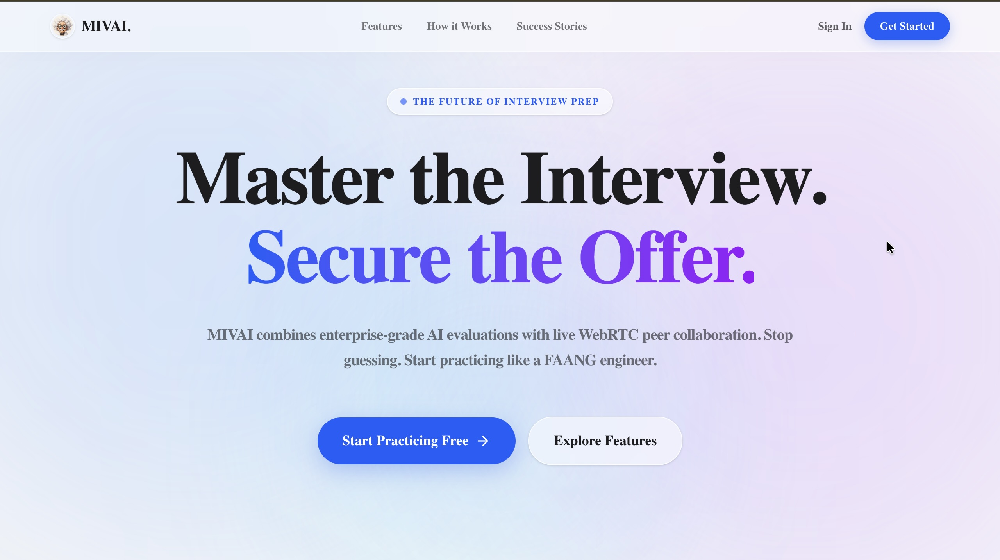
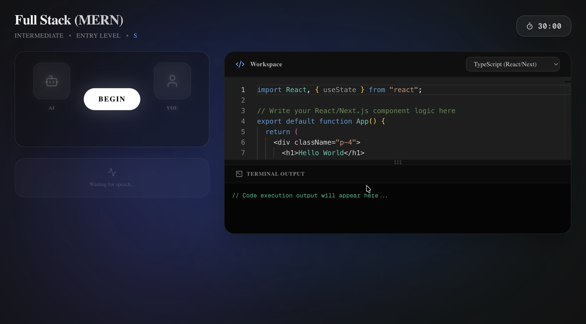
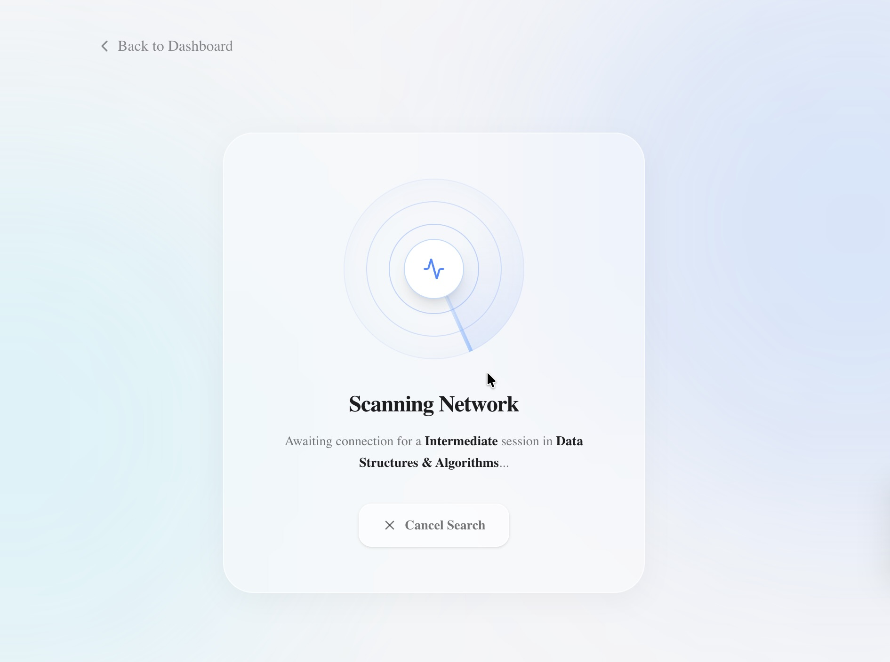
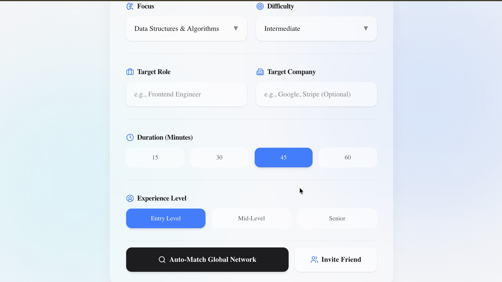
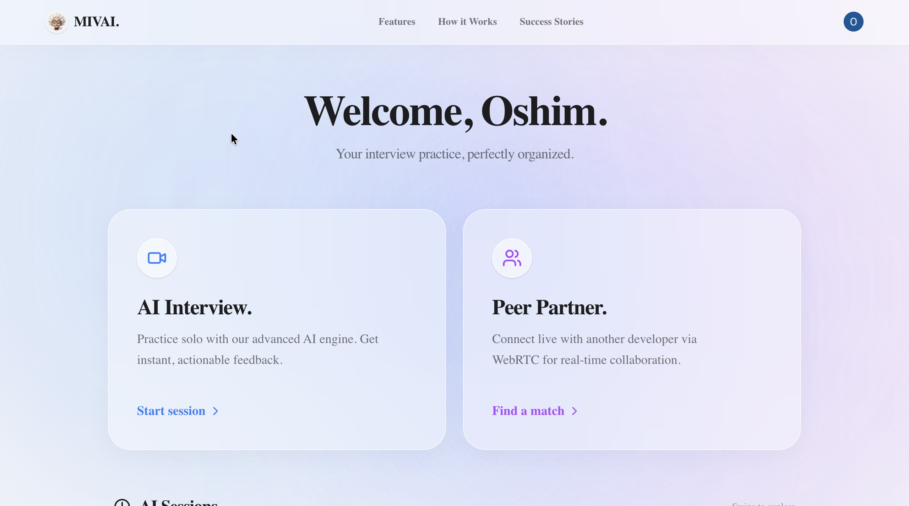

# 🧠 MIVAI: Enterprise AI & WebRTC Interview Platform

<div align="center">
  
</div>

<br/>

<div align="center">
  
  
  
  
  
  
</div>

## 📖 Abstract

MIVAI is a full-stack, distributed web application engineered to bridge the gap between solo algorithmic practice and live technical interviews. By fusing **sub-second latency generative voice AI** with **Conflict-Free Replicated Data Type (CRDT) collaborative environments**, MIVAI provides a frictionless, zero-setup platform for developers to practice, analyze, and perfect their technical interview skills.

Whether practicing against an LLM-driven technical screener or connecting globally via atomic WebRTC matchmaking, MIVAI simulates the exact environment of a FAANG-level engineering interview.

---

## ✨ Core Engineering Feats

### 1. Distributed CRDT Code Synchronization
<div align="center">
  
</div>

Traditional WebSockets suffer from race conditions during simultaneous typing. MIVAI solves this by implementing a **Yjs CRDT engine** bound to a custom instance of the **Monaco Editor**. 
* **Zero-Latency State:** Local keystrokes are applied instantly, while state vectors are synchronized with peers via `y-webrtc`.
* **Remote Execution:** Code is securely packaged and sent to an isolated execution sandbox (JDoodle) to compile and run multi-language ASTs in real-time.

### 2. Real-Time Conversational AI Pipeline
To simulate a human interviewer, standard HTTP polling is too slow. MIVAI utilizes **VAPI** combined with the **Gemini LLM** to maintain a persistent, bidirectional WebSocket stream.
* **Voice Activity Detection (VAD):** Automatically detects user intent and interruptions.
* **Contextual Memory:** The AI maintains the state of the user's code and role context (e.g., "Senior React Engineer" vs. "Entry Level DSA") to ask dynamically scaling follow-up questions.

### 3. Atomic P2P Matchmaking & SFU Tunnels
<div align="center">
  
  
</div>

When a user initiates a peer search, MIVAI bypasses standard queuing by executing atomic database transactions to pair users instantly based on strictly defined parameters (Target Role, Tech Stack, Difficulty). 
* **Secure Media Routing:** Once paired, clients authenticate via cryptographic tokens to a **Stream.io SFU (Selective Forwarding Unit)**, establishing secure WebRTC video and audio tunnels without stressing the Node.js backend.

### 4. Telemetry & Analytics Dashboard
<div align="center">
  
</div>

Performance data isn't just stored; it is synthesized. Post-interview, audio transcripts and code snapshots are parsed to generate quantitative metrics, logging "Hire/No Hire" signals and overall scores for historical tracking.

---

## ⚙️ System Architecture

* **Frontend:** Next.js 14 (App Router), React, Tailwind CSS, Framer Motion (Liquid Glass UI design system).
* **Backend:** Node.js, Express.js, RESTful API.
* **Database:** MongoDB Atlas, Mongoose ORM.
* **Authentication:** Clerk (with secure Webhook syncing to MongoDB).
* **Real-Time Infrastructure:** Stream.io (WebRTC), VAPI (Voice AI Streams), Yjs (State Sync).
* **AI & Execution:** Google Gemini API, JDoodle Compiler API.

---

## 🚀 Quick Start (Local Development)

MIVAI uses a dual-environment setup. You will need API keys for Clerk, Stream, MongoDB, Gemini, VAPI, and JDoodle.

**1. Clone the Repository**
```bash
git clone [https://github.com/yourusername/mivai.git](https://github.com/yourusername/mivai.git)
cd mivai


# Install frontend dependencies
cd frontend && npm install

# Install backend dependencies
cd ../backend && npm install

# Terminal 1 (Backend)
cd backend
npm run dev

# Terminal 2 (Frontend)
cd frontend
npm run dev
